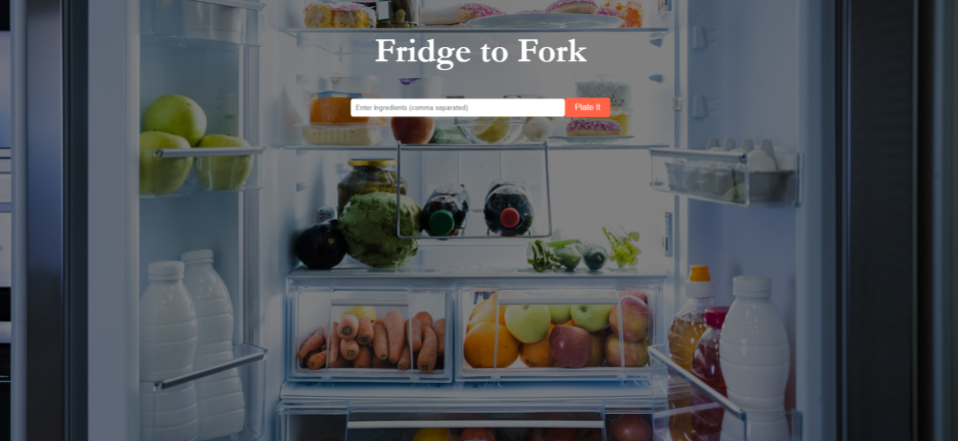

# LockaaRealEstate

# Table of Contents:

  - [Description](#description)
  - [Installation](#installation)
  - [Technology Used](#technology-used)
  - [Test Instructions](#test-instructions)

  - [Usage](#usage)
  - [Contributions](#contributing)
  - [License](#license)

   ## Description

    For my final project, I created a MERN stack site that allows users to input ingredients to generate recipes, which I used the Spoonacular API for.

    This application was made after Thanksgiving, and so everyone was thinking about leftovers and how to use them. Given how people usually don't have a fixed amount of leftovers in there fridge, I left the parameters rather open ended.

    Parameters:
    A comma separated list of ingredients 
    
    Output:
    The first three recipes, the ingredients missing for each recipe, and a button to view a more detailed recipe card

   ## Installation

    GitHub Link: https://github.com/Lockaa/LockaaFridgeToFork

    1. Clone the repository:

    2. CD into client/src

    3. Packages are preinstalled when running due to package.json files

    4. run `npm start` in your terminal, or gitbash

   ## Technology Used
    Spoonacular API
    MongoDB
    Express
    React
    Node.js

   ## Test Instructions

   npm start in the /client/src directory

   ## Usage

   Users are brought to the main screen, where they can input the ingredients and generate a recipe

   

   ## Contributing:
   Anyone is allowed to add any changes just as long as these steps are followed:
    Fork the repository.
    Create a new branch (`git checkout -b new-branch`).

    Make your changes and commit them. (`git commit -m 'Neww Adjustments'`).
    Push to your branch (`git push origin new-branch`).
    Open a pull request.

   ## License

   Standard MIT License

   ## Notes
   Given I was the only one who worked on this project, there are not many pull requests, so please check the commit history instead.
